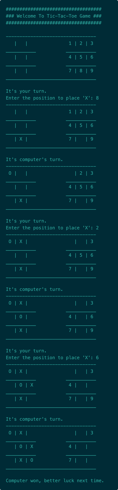
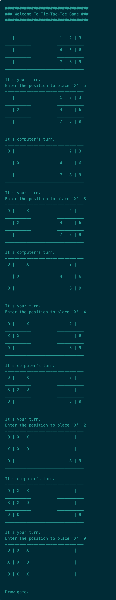
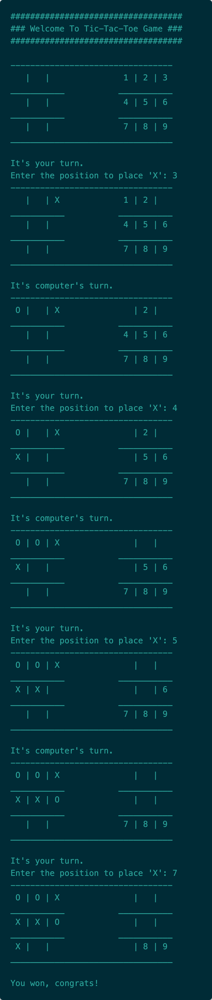

# Tic Tac Toe

**Tic-Tac-Toe** is a console based game to play with **computer**.

## Commands

- g++ tic_tac_toe.cpp -o tic_tac_toe && ./tic_tac_toe

## Game Scenarios

Hey, let's play the game with computer.

Oh computer won the game. Let's play again.

It's draw game. You played better this time. Let's beat the computer now.

You won the game. Congrats!

[Back To The Top](#tic-tac-toe)
